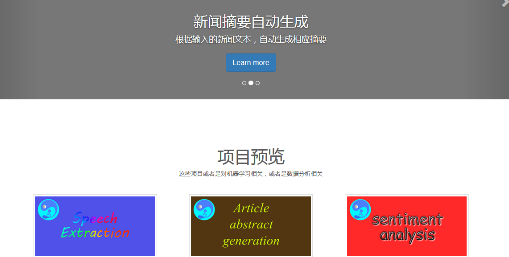
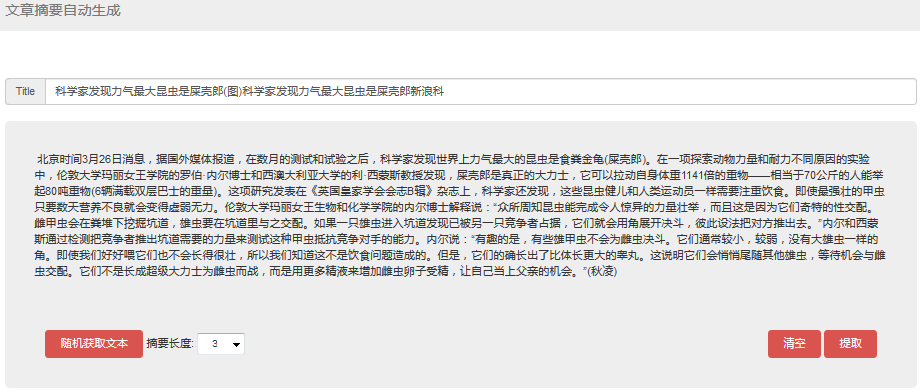
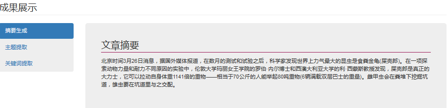
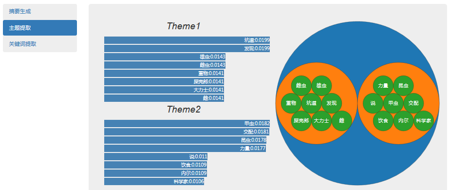
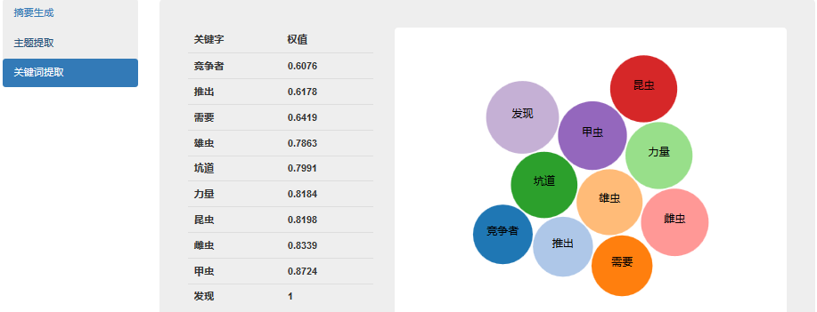

# 文本摘要自动生成

[源代码](abstract_extraction.py)

- web访问端口：8567

## 摘要系统简介：

**该摘要自动生成为提取式摘要生成，主要应用了以下等技术**

- 基于word2vec词向量的句子向量化，相似度计算
- 关键字提取
- 主题判别
- 文章不同位置不同处理
- 标题处理
- Knn平滑处理
- 整合以上6个维度信息进行摘要生成

## web展示

### 主页面

点击摘要自动生成相应模块进入相应模块页面：
进入页面请耐心等候模型载入(结束了也多等会)，因为为节约服务器内存，模型设置了自动释放和载入功能

### 输入部分

**按钮-随机获取文本：**可从数据库中随机获取一篇测试文本

**Title**：可选项，输入标题可获得更好预期效果

**摘要长度：**可自定义需要生成的摘要长度

### 提取结果

- 摘要

  

- 主题分布

  

- 关键词分布

  

